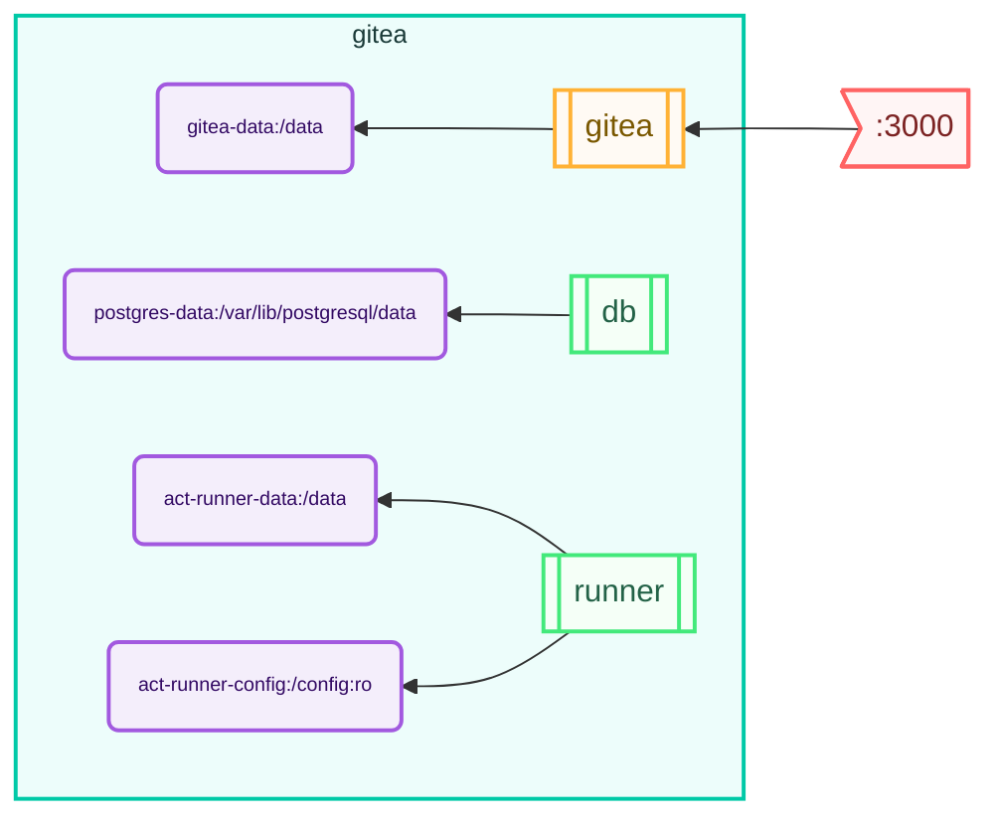

# Gitea

Gitea stack.

Deploy a batteries included [gitea](https://about.gitea.com/) system with its database and CI/CD Actions hosted in containers using the [stack](https://github.com/bozemanpass/stack) tool. Transparently deploy to either Docker/Podman or k8s.

## System Diagram
The diagram below was auto-generated using `stack diagram`:
<!-- CHART_BEGIN -->

<!-- CHART_END -->
